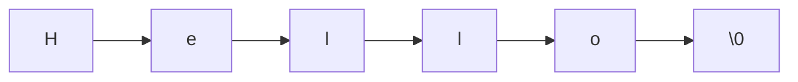

`"chota bheem"` collection of letters known as string is a fundamental type of every major language languages like python provides native strings by implementing them something like this


```c
typedef struct {
    PyObject_HEAD
    Py_ssize_t length;
    // Number of characters (not bytes)
    Py_hash_t hash;// Cached hash value
    struct {
        unsigned int interned:2;
        // Interning state
        unsigned int kind:3;
        // Storage format (1/2/4 bytes per char)
        unsigned int compact:1;   // Compact layout (saves space)
        unsigned int ascii:1;     // ASCII-only?
        unsigned int ready:1;     // Ready flag for lazy initialization
        unsigned int padding:24;  // Padding for alignment
    } state;
    wchar_t *wstr;                // Legacy wchar_t representation (optional)
} PyUnicodeObject;
```

While looking at all this chatgted structure defination you must think that's a lot of dogshit for just some string but having all this pre defined by language allows you to have a strong string arsenal like `python` does while c doesn't have something inherently called a string datatype with abilities of slightly modern languages.

## '\0' Background 
In C we want to use string we just use a character array and place a `\0` at the end of it now you may ask why `\0` and not some other symbol well most simple reason for this is c developers came to a agreement for `\0` now `\0` translate to 0 which is the same value that null translate to but they are not the same 

```c
int * ptr=Null;
//a pointer to value 0 
//Typically #define Null (void * )0

int * ptr ='\0';
//a character with value 0

//Both result in 0 which is technically correct and code 
//will function but isn't recommended because it may lead 
//to less readability and because you are assigning a char 
//where a pointer to 0 (NULL) is expected 

```
## Basic  strings declaration and memory layout 
Let's say you want to declare a string called str 
```c
char str[6]="Hello";
```
- This initializes an character array of length 6 that in memory looks like



- Now you may think from where did `\0` come from well compilers are smart af nowadays and they will place null char at the end if they empty space ahead at the last element's memory location
```c
 char str[5]="hello";
```
- Now with the array size of 5 there will not be enough space available for compiler to place `\0` at the end of array thus resulting in a simple array of characters instead of a string without the `\0` many c functions will read past the bound and will result in undefined behaviour.

```c
char str1[]="sfdf";
char str2[5]="Hello";// with size being only 5 '\0' cant be stored
char str3[]="312";

printf("%s",str2);
return 0;
```

```
OUTPUT
1.Hellosfdf

%s reading str without \0 will read pass the bound 
and stack being FILO data structure the variable 
str1 that was declared first will be ahead in the memory.
```





```mermaid
graph TD

direction TB

  

%% Visual stack growth indicator

stack_dir["⬇️ Stack grows downward (high ➝ low memory)"]

  

%% str1 layout

subgraph STR1 ["char str1[]="sfdf""]

str1_start["0x7FFE00B0: 's'"]

str1_1["0x7FFE00B1: 'f'"]

str1_2["0x7FFE00B2: 'd'"]

str1_3["0x7FFE00B3: 'f'"]

str1_4["0x7FFE00B4: '\\0'"]

str1_start --> str1_1 --> str1_2 --> str1_3 --> str1_4

end

  

%% str2 layout (NO null terminator)

subgraph STR2 ["char str2[5]=Hello"]

str2_start["0x7FFE00AB: 'H'"]

str2_1["0x7FFE00AC: 'e'"]

str2_2["0x7FFE00AD: 'l'"]

str2_3["0x7FFE00AE: 'l'"]

str2_4["0x7FFE00AF: 'o'"]
str2_5["str1[0]"]

str2_start --> str2_1 --> str2_2 --> str2_3 --> str2_4 --> str2_5

end

  

%% str3 layout

subgraph STR3 ["char str3[]="312""]

str3_start["0x7FFE00A0: '3'"]

str3_1["0x7FFE00A1: '1'"]

str3_2["0x7FFE00A2: '2'"]

str3_3["0x7FFE00A3: '\\0'"]

str3_start --> str3_1 --> str3_2 --> str3_3

end
```

## Memory layout with string functions 
C provides various string related functions that provides string manipulation through `string.h` header file 

### strcpy(destination, source)

#### TL;DR
```c
//Function defination 
strcpy(char *dest,const char* src)
```


```c
char str[6]="Hello";
char str2[6];

strcpy(str2,str);
printf("%s",str2);

//OUTPUT:
//Hello
```
- str points to start of the str array and str2 points to the start of the str2 array.
- str-->str[0] and str2-->str2[0].
- when we pass str and str2 to strcpy() we pass pointers to the start of the function because (array names decays into pointers when passed through functions )
- strcpy() starts copying byte by byte untill it encounters `\0` and copies it at last now `what if the destination array/memory space is not enough will program work?` let's look at this question through a practical program.

```c
char str[6]="Hello";
char str2[4];

strcpy(str2,str);
//after strcpy
//str={'o' '\0' 'l' 'l' 'o' '\0'};
//str2={'H' 'e' 'l' 'l'}
printf("this is str %s\n",str);
printf("this is str2 %s",str2);

//OUTPUT
// this is str o
//this is str2 Hello

//hell get copied to  str2 and remaning goes to memory that is in front of it and as it's a stack and with a sparkle on some endianess memory that region is str and remaining content get written into  
```

**BEFORE STRCPY**

```c
Memory layout :

str[6]   : [ 'H', 'e', 'l', 'l', 'o', '\0' ]
str2[4]  : [ ??, ??, ??, ?? ]   // uninitialized memory
```
**AFTER STRCPY**

```c
Memory layout (overflow!):

str2[4]  : [ 'H', 'e', 'l', 'l' ]
          :        ▲
          :        └───────┐
                           ▼
      [ memory beyond str2 is overwritten! ]
          : [ 'o', '\0' ]      ← written into memory not owned by str2

```
- Now when you pass a smaller destination for a bigger source strcpy tends to write outside the buffer which results in undefined behaviour causing different outputs
- str2 with only size 4 receives write request of size 6 and what happens is Str2 get full with only "Hell" and remaining buffer "o\0" get copied into illegal memory infront of it or may not it depends on the compiler 
- str3 get overwritten by str2

#### After strcpy stack memory layout

| Offset from `%rbp` | Decimal Address   | Value  | Description                       |
| ------------------ | ----------------- | ------ | --------------------------------- |
| `rbp-10` (`-0x0A`) | `140737488346102` | `'o'`  | `str[4]`                          |
| `rbp-11` (`-0x0B`) | `140737488346101` | `'l'`  | `str[3]`                          |
| `rbp-12` (`-0x0C`) | `140737488346100` | `'l'`  | `str[2]`                          |
| `rbp-13` (`-0x0D`) | `140737488346099` | `'\0'` | `str[1]` (after strcpy overwrite) |
| `rbp-14` (`-0x0E`) | `140737488346098` | `'o'`  | `str[0]` (after strcpy overwrite) |
| `rbp-15` (`-0x0F`) | `140737488346097` | `'\0'` | `str[5]` null terminator          |
| `rbp-19` (`-0x13`) | `140737488346093` | `'l'`  | `str2[3]`                         |
| `rbp-20` (`-0x14`) | `140737488346092` | `'l'`  | `str2[2]`                         |
| `rbp-21` (`-0x15`) | `140737488346091` | `'e'`  | `str2[1]`                         |
| `rbp-22` (`-0x16`) | `140737488346090` | `'H'`  | `str2[0]`                         |


### Strncpy (destination,source,size)

#### TL;DR
**strncpy**  is somewhat more secure implementation of the strcpy **Spoiler Alert: it isn't**  it just copies a specific amount and whola! now you can break things precisely.

```c
//function defination
strncy(char *dest,const char* src,size_t size)
```

```c
char str[6]="Hello";
char str2[6];

strncpy(str2,str,sizeof(str2));
printf("%d",str2);

//OUTPUT:
//Hello
```
- Now i don't need to explain things that i did in strcpy so i'll just tell you what's new here
- **strncpy** is nothing but strcpy with a size restricter 
- strcpy copied data byte by byte untill the src data was fully copied regardless of the bounds **while  strncpy** does the same but it copies the data byte by byte untill only the size you specified and yeah that can go out of bound  
- if src is shorter then dest then dest is padded with `\0`

#### let's make a mess

```c

char str[6]="Hello";
char str2[4];

strncpy(str2,str,sizeof(str2));
//after strncpy
//str={'H' 'e' 'l' 'l' 'o' '\0' }
//str2={'H' 'e' 'l' 'l'}

//now some of you may think well it's much better then strcpy one how exactly did we mess things up

printf("this is str %s\n",str);
printf("this is str2 %s",str2);

//OUTPUT
//this is str Hello
//this is str2 HellHello

//Oopsie someone forgot to add a null terminator  to the str2 which resulted in %s reading untill it encounters one
```
- See %s works by taking a pointer and reading until it encounter a null terminator after which it concludes that it is the end of the string
- In this program we specified the size of the str2 (size=4) to  strncpy .It just did that and copied exactly 4 bytes into the str2 not even  touching out of str2 memory space but it doesn't automatically add a null terminator so when we try to print a string using %s it reads untill it encounter str's null terminator and then finally stops
